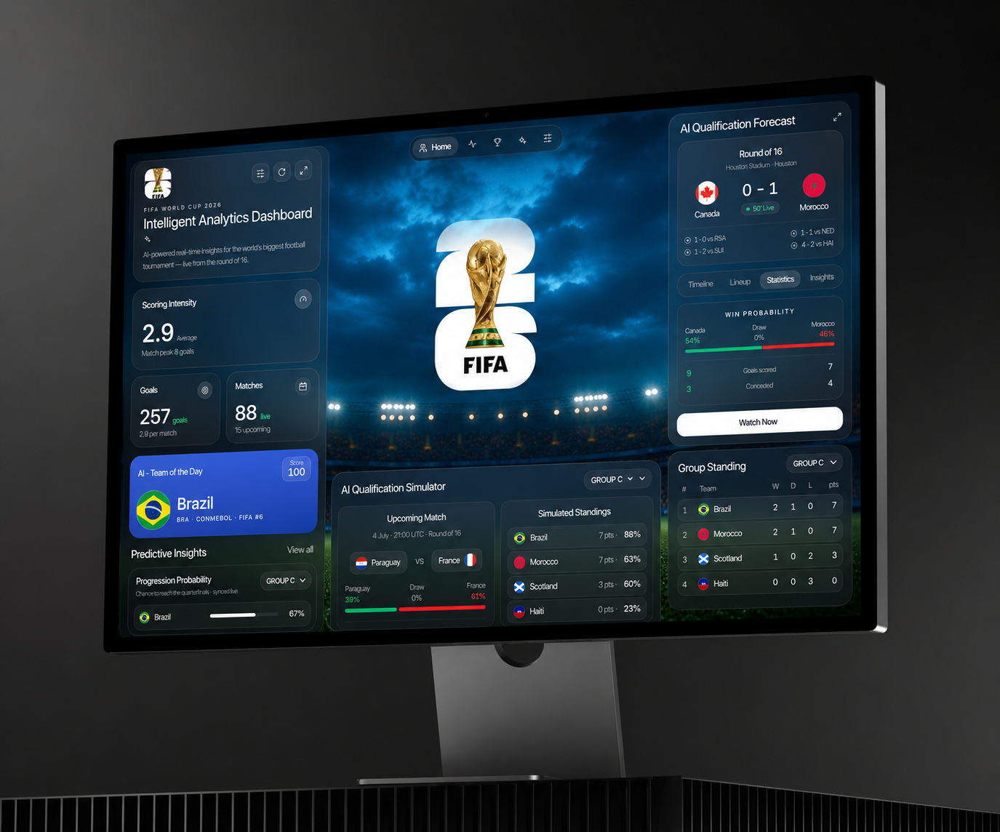

<div align="center">

# 🏆 2026 World Cup Tracker

**Every World Cup insight you actually want, in one place.**

[](https://github.com/Tanish-Dev/worldcup-predictor)



</div>

---

## About

I built this because the official FIFA website is a pain to actually get
anything out of — the info is scattered across a dozen different pages, the
navigation is clunky, and there's no single place that just shows you
**what's happening and what's coming up**. So I built the dashboard I
actually wanted: one page for upcoming and live matches, current team and
player stats, group standings, and — since I was already pulling all the
historical data anyway — a model that predicts how the rest of the
tournament plays out.

Under the hood:

- A **Poisson attack/defense rating** is fit for every national team using
  scikit-learn on **964 historical World Cup matches** (1930–2022), with
  cold-start calibration for debutant or sparse-history teams against their
  FIFA ranking points, and a home-advantage term learned from each match's
  actual host nation.
- That model seeds a **pre-tournament Monte Carlo simulation** of the entire
  bracket, run 50,000 times.
- Once the real tournament kicks off, the app pulls the **live 2026 match
  feed** — scores, penalty shootouts, the real knockout bracket, squads,
  player stats — directly from FIFA's public API, revalidated every 5
  minutes.
- Everything FIFA has already decided on the pitch is treated as fixed; only
  the _unplayed_ matches are re-simulated, so the odds you see are always
  conditioned on reality, not just pre-tournament priors.

The result is a live dashboard: upcoming/live matches, group standings,
qualification probabilities, a playable "simulate one ending" bracket, team
and player pages, and a full methodology write-up baked into the app itself
— everything the FIFA site has, minus the hunting around for it.

## Features

- 📅 **Matches, all in one place** — every fixture, live scores, and results
  from the whole tournament, no clicking through five pages to find them
- 📊 **Live analytics dashboard** — scoring intensity, goals, live match
  status, and an AI "team of the day" pulled straight from current form
- 🏳️ **Team & player pages** — current squads, live 2026 stats, historical
  form, FIFA rankings, per-team deep dives
- 📈 **Rankings & history** — power ratings, past tournaments, full match
  archive
- 🔮 **Qualification simulator** — win/draw/loss probabilities for every
  upcoming fixture, continuously re-conditioned on real results
- 🌳 **Interactive bracket** — play out the rest of the tournament yourself,
  client-side, using the same simulation engine that powers the server
- 🧠 **Methodology page** — the model, in plain English, inside the app

## Stack

**Frontend:** Next.js (App Router, Server Components, `fetch`
revalidation/ISR, Server/Client boundary), TypeScript, Tailwind CSS, Recharts,
GSAP

**Modeling:** Python, scikit-learn (`PoissonRegressor`), pandas

## How it works

1. **[`model/pipeline.py`](model/pipeline.py)** fits a Poisson attack/defense
   rating for every team on 964 historical World Cup matches, calibrates
   cold-start teams against FIFA ranking points, fits a home-advantage term
   from each match's actual host nation, then Monte Carlo simulates the
   pre-tournament bracket 50,000 times and writes the results to `data/*.json`.
2. **[`src/lib/fifa.ts`](src/lib/fifa.ts)** pulls the live 2026 match feed
   (results, scores, penalty shootouts, the real knockout bracket, team
   flags) from FIFA's public API, cached with Next.js `fetch` revalidation (5
   minutes) so every page is static-fast but never more than a few minutes
   stale.
3. **[`src/lib/liveOdds.ts`](src/lib/liveOdds.ts)** re-simulates only the
   matches FIFA still lists as unplayed, server-side, conditioning the title
   odds on everything already decided on the pitch.
4. **[`src/lib/bracket.ts`](src/lib/bracket.ts)** is the shared simulation
   engine — the same code powers the server-side odds and the client-side
   "play out one ending" button on `/bracket`.

Full methodology write-up: `/methodology` in the running app.

## Getting started

```bash
npm install
npm run dev
```

Open [http://localhost:3000](http://localhost:3000).

### Regenerating the model

The prediction data in `data/` is checked in, so the app runs without Python.
To regenerate it (e.g. after updating the source CSVs in `model/data-raw/`):

```bash
cd model
pip install -r requirements.txt
python3 pipeline.py
```

## Project structure

```
model/               Python data pipeline (training + simulation)
data/                Generated JSON consumed by the app
src/app/              Routes: home, rankings, teams/[code], bracket, history,
                       matches, players, venues, methodology
src/components/      UI components (charts, tables, nav)
src/lib/             Data access layer + client-side simulation
```

## Installing as an app (PWA)

The app ships a [web manifest](src/app/manifest.ts) and an
[Apple touch icon](src/app/apple-icon.png), so it can be installed to your
home screen with a real icon instead of a blank browser bookmark:

- **iPhone / iPad (Safari):** open the site → tap the **Share** icon → **Add
  to Home Screen**.
- **Android (Chrome):** open the site → tap the **⋮** menu → **Add to Home
  screen** / **Install app**.

Once installed it launches full-screen, without Safari's/Chrome's browser
chrome, like a native app.

---

<div align="center">

Built for the 2026 FIFA World Cup 🇺🇸 🇲🇽 🇨🇦

</div>
